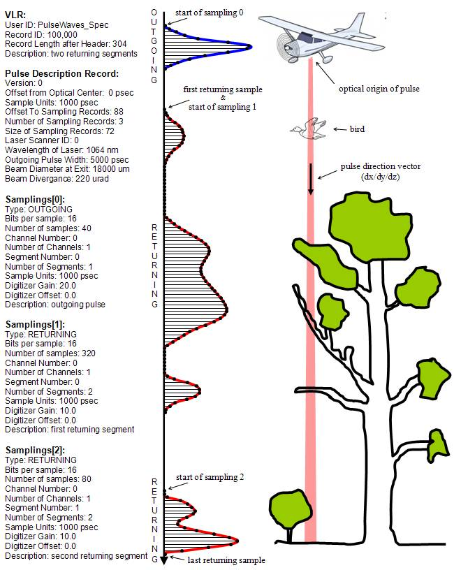

.. raw:: pdf

    SetPageCounter 1 arabic

.. footer::

   This is the official PulseWaves document. It describes the specification of an open, stand-alone, vendor-neutral, LAS-compatible data exchange format for geo-referenced full waveform LiDAR data.

   Page ###Page###

Date: 

draft created on Dec 23th, 2011

***************************************************************************************
 PulseWaves - Full Waveform LiDAR Specification (version 0.1)
***************************************************************************************

.. class:: heading4
    
This document describes the *PulseWaves* specification - an open, stand-alone, vendor-neutral, LAS-compatible data exchange format for storing geo-referenced full waveform LiDAR. The document is distributed for the purpose of discussing, evaluating, and brain-storming the PulseWaves format in its initial 1.0 version.  The current draft is expected to continuously change before the actual 1.0 version is released. One of the design goals is to remain forward compatible and allow for changing demands such as additional or different fields in the data records without breaking PulseWaves readers that only implement olders version of the specification.

The PulseWaves format consists of two binary files: The *Pulse* files (\*.pls) describe the emitted laser pulses with geo-referenced origin and direction. The *Waves* files (\*.wvs) contain the samples of the outgoing and returning waveform shapes for the relevant sections of these pulses (e.g. in the vicinity of where something was hit). The PulseWaves format is meant to be compatible with the LAS format of the ASPRS. These *Laser* files (\*.las) describe discrete returns with attributes where either the sensor hardware or some post-processing software have computed that something was "hit" by the laser beam. Via the GPS time it is possible to find the PulseWaves that the Laser returns are "attached" to.

==============================================================================
Introduction
==============================================================================

This document describes the simple PulseWaves data exchange format for storing geo-referenced full waveform data that is compatible with the LAS format and just as simple to parse and use. It consists of two binary files: a Pulse file (\*.pls) and a Waves (\*.wvs) file. 

The Pulse file is stand-alone. It describes a geo-referenced locations and directions of the pulses. For each fired pulse it stores the geo-referenced coordinates of the lasers's optical center and the geo-referenced direction vector of the pulse together with the moment that the first and last sample for the returning waveform was recorded. This file alone is, for example, already sufficient to verify coverage or "sweep out" the scanned 3D space.

The Waves file is *not* stand-alone and depends upon the Pulse file. Each pulse in the Pulse file contains an offset into the Waves file to where the actual digitized samples for the relevant segments of that pulse are stored that describe the shape of the waveform in detail. The format how the waveforms are sampled is kept flexible as each pulse references a sampling description. 

Via the GPS time the pulses in the Pulse file and their associated Waves may (optionally) be linked to the discrete point returns stored in corresponding LASer files and vice-versa.

==============================================================================
The Pulse file (\*.pls)
==============================================================================

The Pulse file is a binary file consisting of a Header, any number of optional Variable Length Records (VLRs), the Pulse Records, and one or more Appended Variable Length Records (AVLRs). All data are in little-endian format.

The Header contains generic data such as the version of the file, creation date, the number of pulses, etc. The Variable Length Records (VLRs) and the Appended Variable Length Records (AVLRs) contain various types of additional data, most importantly the description of how the waveform are sampled and the geo-referencing information, but also additional sensor data or user defined data. The AVRLs are essentially just like the VLRs but can be appended at the end of the file. This allows, for example, to add another pulse description, correct the projection information, or include a spatial indexing data structure to an existing Pulse file without having to re-write the entire file.

.. csv-table:: The Pulse File Structure 
    :widths: 100

    "Header"
    "Variable Length Records (VLRs)"
    "Pulse Records"
    "Appended Variable Length Records (AVLRs)"

The waveform samples of the pulses that are reported in the Pulse Records are stored in a separate Waves file that must be in the same directory and have the same base name as the *.pls file, but have the ending *.wvs. 

.. csv-table:: The Pulse Header
    :header: "Item", "Format", "Size"
    :widths: 70, 10, 10
    
    "File Signature (“PulseWavesPulse”)", "char[16]", "16 bytes"
    "File Source ID", "unsigned long", "4 bytes"
    "Global Encoding", "unsigned long", "4 bytes"
    "Project ID - GUID data 1", "unsigned long", "4 bytes"
    "Project ID - GUID data 2", "unsigned short", "2 bytes"
    "Project ID - GUID data 3", "unsigned short", "2 bytes"
    "Project ID - GUID data 4", "unsigned char[8]", "8 bytes"
    "System Identifier", "char[32]", "32 bytes"
    "Generating Software", "char[32]", "32 bytes"
    "File Creation Day of Year", "unsigned short", "2 bytes"
    "File Creation Year", "unsigned short", "2 bytes"
    "Version Major", "unsigned char", "1 byte"
    "Version Minor", "unsigned char", "1 byte"
    "Header Size", "unsigned short", "2 bytes"
    "Offset to Pulse Records", "long long", "8 bytes"
    "Number of Variable Length Records", "unsigned long", "4 bytes"
    "Number of Appended Variable Length Records", "long", "4 bytes"
    "Pulse Format", "unsigned short", "2 bytes"
    "Pulse Compression", "unsigned short", "2 bytes"
    "Pulse Record Size", "unsigned long", "4 bytes"
    "Number of Pulse Records", "long long", "8 bytes"
    "X Scale Factor", "double", "8 bytes"
    "Y Scale Factor", "double", "8 bytes"
    "Z Scale Factor", "double", "8 bytes"
    "X Offset", "double", "8 bytes"
    "Y Offset", "double", "8 bytes"
    "Z Offset", "double", "8 bytes"
    "Max X", "double", "8 bytes"
    "Min X", "double", "8 bytes"
    "Max Y", "double", "8 bytes"
    "Min Y", "double", "8 bytes"
    "Max Z", "double", "8 bytes"
    "Min Z", "double", "8 bytes"

Any field in the Pulse Header that is not required or that is not used must be zero filled.

File Signature:
  The file signature must contain the zero-terminated string of 16 characters “PulseWavesPulse" that can be checked by user software as a quick look validate the file type.

File Source ID:
  If this file contains the pulses from an original flight line this field should contain the flight line number. A value of zero (0) is interpreted to mean that an ID has not been assigned. 

Global Encoding:
  This is a bit field used to indicate certain global properties about the file.

Project ID (GUID data):
  These four fields describe a Globally Unique Identifier (GUID) for use as a Project Identifier (Project ID). These fields are at the discretion of processing software. They should be the same for all files associated with a unique project. By assigning a Project ID and using a File Source ID for every file within the project, every pulse can be uniquely identified.

Version Number:
  The version number consists of a major and minor field. All minor versions of the same major version will be fully forward and backward compatible.

System Identifier:
  This information is ASCII data describing the hardware sensor that collected or the process that generated the pulse records in this file. If the character data is less than 31 characters, the remaining data must be null.

Generating Software:
  This information is ASCII data describing the generating software itself.  This field provides a mechanism for specifying which generating software package and version was used during Pulse file creation (e.g. “TerraScan V-10.8”,  “REALM V-4.2”, " RiPROCESS 1.4.16.51", etc.).  If the character data is less than 31 characters, the remaining data must be null.

File Creation Day of Year:
  The day on which this file was created. Day is computed as the Greenwich Mean Time (GMT) day. January 1 is considered day 1.

File Creation Year:
  The year, expressed as a four digit number, in which the file was created.  

Header Size:
  The size, in bytes, of the Pulse Header itself. For version 1.0 this size is 224  bytes. If the header is extended through the addition of data at the end of the header by a new revision of the Pulse specification, the Header Size field will reflect this. 

Offset to Pulse Records:
  The actual number of bytes from the beginning of the file to the first pulse record data field.  This data offset must be updated if any software adds/removes data to/from the Variable Length Records.

Number of Variable Length Records:
  This field contains the current number of VLRs that are stored in the file before the Pulse Records. This number must be updated if the number of VLRs changes.

Number of Appended Variable Length Records:
  This field contains the current number of AVLRs that are stored the file after the Pulse Records. This number should be updated if the number of AVLRs changes. This number may be set to \"-1\", which indicates that the number of AVLRs is not known and must be determined my parsing the AVLRs starting at the end of the file.

Pulse Format:
  The format of the pulse records. In version 1.0 this is always 0.

Pulse Compression:
  The compression scheme used for the pulse records. In version 1.0 there is no compression and this is always 0.

Pulse Record Length:
  The size, in bytes, of the Pulse Record. All Pulse Records within a Pulse file have the same type and hence the same length. If the specified size is larger than implied by the pulse format (e.g. 32 bytes instead of 28 bytes for format 0) the remaining bytes are user-specific “extra bytes”. The meaning of such “extra bytes” can be described with an Extra Bytes VLR (see Table 12 and Table 24) to make them useful to others as well.

Number of Pulse Records:
  This field contains the total number of pulse records within the file.

X, Y, and Z Scale Factors:
  The scale factor fields contain double-precision floating point values used to scale the X, Y, and Z long values of the pulse records. If the actual x, y, z coordinates have two decimal point values, then each scale factor will contain the number 0.01.   

X, Y, and Z Offset:
  The offset fields contain double-precision floating point values used to offset  the X, Y, and Z long values of the pulse records. The formulas shown below convert from the X, Y, and Z long values of each pulse to the actual x, y, z coordinates.

  x_{coordinate} = (X_{record} \* x_{scale}) + x_{offset}

  y_{coordinate} = (Y_{record} \* y_{scale}) + y_{offset}

  z_{coordinate} = (Z_{record} \* z_{scale}) + z_{offset}

Max and Min X, Y, Z:
  The max and min fields describe the bounding box that includes the start and end points of the sampled parts of the returning waveforms of all pulses.

Variable Length Records (VLRs):
------------------------------------------------------------------------------

The Pulse Header can be followed by any number of Variable Length Records (VLRs). The number of VLRs is specified in the “Number of Variable Length Records” field in the Pulse Header. The Variable Length Records must be accessed sequentially since the size of each Variable Length Record is contained in the Variable Length Record Header.  Each Variable Length Record Header is 64 bytes in length. 

.. csv-table:: Variable Length Records (VLRs)
    :header: "Item", "Format", "Size"
    :widths: 70, 10, 10

    "User ID", "char[16]", "16 bytes"
    "Record ID", "unsigned long", "4 bytes"
    "Reserved", "unsigned long", "4 bytes"
    "Record Length After Header", "long long", "8 bytes"
    "Description", "char[32]", "32 bytes"

User ID:
  The User ID field of ASCII characters identifies the user which created the Variable Length Record. If the character data is less than 16 characters, the remaining data must be null. The User ID "PulseWaves_Spec" is reserved. The User IDs "LASF_Spec" and "LASF_Projection" from the LAS 1.4 specification are also reserved.

Record ID:
  The Record ID allows to distinuish different VLRs with the same User ID. The Record IDs for the User ID "PulseWaves_Spec" are reserved. Publicizing the meaning of a Record ID is left to the owner of the given User ID. 

Reserved:
  Must be zero.

Record Length after Header:
  The record length is the number of bytes for the record after the end of the standard part of the header. The entire record length is 64 bytes (the header size of the VLR) plus the Record Length after Header.

Description:
  Null terminated text description (optional).  Any characters not used must be null.

Appended Variable Length Records (AVLRs):
------------------------------------------------------------------------------

The Pulse Records are followed by Appended Variable Length Records (AVLRs). The AVLRs are in spirit just like the VLRs but carry their payload "in front" of the footer that desribes them. They are accessed sequentially in reverse starting from the end of the file. There is at least one mandatory AVLR that indicates the end of the AVLR array. Because the AVLRs are accessed in reverse this mandatory AVLR is the first AVLR after the pulse records. The number of AVLRs is specified in the “Number of Appended Variable Length Records” field in the Pulse Header. Setting this number to a negative value (e.g. -1) means that their number is not known but must be discovered by parsing the AVLRs starting from the end of the file. 

.. csv-table:: Appended Variable Length Records (AVLRs)
    :header: "Item", "Format", "Size"
    :widths: 70, 10, 10

    "User ID", "char[16]", "16 bytes"
    "Record ID", "unsigned long", "4 bytes"
    "Reserved", "unsigned long", "4 bytes"
    "Record Length Before Footer", "long long", "8 bytes"
    "Description", "char[32]", "32 bytes"

Pulse Records:
------------------------------------------------------------------------------

All records must be the same type. Unused attributes must be set to the equivalent of zero for the respective data type (e.g. 0.0 for floating-point numbers, NULL for ASCII, 0 for integers). The pulse record format 0 expresses the pulse as an anchor point plus direction vector.

.. csv-table:: Pulse Record Type 0
    :header: "Item", "Format", "Size"
    :widths: 70, 10, 10

    "GPS time", "double (or long long)", "8 bytes"
    "Offset to WaveSamples", "long long", "8 bytes"
    "X_A", "long", "4 bytes"
    "Y_A", "long", "4 bytes"
    "Z_A", "long", "4 bytes"
    "dx", "float", "4 bytes"
    "dy", "float", "4 bytes"
    "dz", "float", "4 bytes"
    "First Returning Sample [sampling units]", "short", "2 bytes"
    "Last Returning Sample [sampling units]", "short", "2 bytes"
    "Index of Pulse Descriptor", "14 bits (bit 0-13)", "14 bits"
    "Edge of Flight Line", "1 bit (bit 14)", "1 bit"
    "Scan Direction", "1 bit (bit 15)", "1 bit"

GPS time:
  The GPS time at which the laser pulse was fired. For compatibility with LAS 1.4 this field will usually store either the GPS week time or the Adjusted Standard GPS time as a double-precision floating point number. This is specified by the global encoding bits in the Pulse header.

Offset to WaveSamples:
  The offset in bytes from the start of the Waves file to the samples of the waveform. How the pulse is sampled (and more) is described in the indexed "Pulse Descriptor".

X_A, Y_A, and Z_A:
  The anchor point of the pulse. Scaling and offseting the integers X_A, Y_A, and Z_A with scale and offset from the header gives the actual coordinates in world coordinates. The anchor point equals the location of the scanner's optical origin at the time the laser was fired, if the "Offset from Optical Center to Anchor Points" field of the "Pulse Description Record" is zero.

  x_{anchor} = (X_A \* x_{scale}) + x_{offset}

  y_{anchor} = (Y_A \* y_{scale}) + y_{offset}
 
  z_{anchor} = (Z_A \* z_{scale}) + z_{offset}

dx, dy, and dz:
  The pulse direction vector is scaled to the length of units in the chosen world coordinate system (e.g. meters for UTM, decimal degrees for long/lat, feet or survey feet for US stateplane reference systems) that the laser pulse travels in one (1) nanosecond away from the origin (e.g. towards the ground in an airborne survey).

First Returning Sample:
  The duration in sampling units from the anchor point to the first recorded waveform sample. Together with the "Sample Units" value from the corresponding "Pulse Description Record" this value allows computing the x/y/z world coordinates of the first intensity sample that was recorded for the returning waveform of this pulse:

  x_{first} = x_{anchor} + first_returning_sample \* sample_units * dx

  y_{first} = y_{anchor} + first_returning_sample \* sample_units * dy

  z_{first} = z_{anchor} + first_returning_sample \* sample_units * dz

Last Returning Sample:
  Same concept as the "First Returning Sample" but for the last one:

  x_{last} = x_{anchor} + last_returning_sample \* sample_units * dx

  y_{last} = y_{anchor} + last_returning_sample \* sample_units * dy

  z_{last} = z_{anchor} + last_returning_sample \* sample_units * dz

Index of Pulse Descriptor:
  The record ID minus 100,000 of the "PulseWaves_Spec" VLR or AVLR that contains a description of this laser pulse and the exact details how its waveform is sampled in form of a "Pulse Descriptor". Up to 16,384 different descriptors can be specified. A pulse descriptor consist of a "Pulse Description Record" followed by a variable number "Sampling Description Records".

Scan Direction Flag:
  This bit remains the same as long as pulses are output with the mirror of the scanner travelling in the same direction or as long as they are reflected from the same mirror facet of the scanner. It flips whenever the mirror direction or the facet changes.

Edge of Flight Line:
  This bit has a value of 1 when the output pulse is at the end of a scan line. It is the last pulse before the scanning hardware changes direction, mirror facet, or zigs back.

Defined Variable Length Records (VLRs or AVLRs):
------------------------------------------------------------------------------

The same mechanism described for the "LASF_Projection" VLR of the LAS 1.4 specification can be used to geo-reference the pulse file. The same mechanism described for the "LASF_Proj" VLR "Extra Bytes" of the LAS 1.4 specification can be used to specify extra attributes per pulse.

First Appended Variable Length Record:
------------------------------------------------------------------------------

User ID:                        PulseWaves_Spec

Record ID:                      4,294,967,295 (0xFFFFFFFF)

Record Length Before Footer:    0

This empty AVLR record *MUST* directly follow the pulse records and it must be the first AVLR in case there are multiple AVLRs. It does not carry a payload but is used to mark the end of the appendable list of AVLRs. This is needed as the exact number of AVLRs may not be specified in the header and needs to be discovered by parsing all AVLRs starting at the end of the file until this one is readed. This Record ID makes no sense when used with an VLR. 

Pulse Descriptor:
------------------------------------------------------------------------------

User ID: 	                    PulseWaves_Spec

Record ID: 	                    n (where 100,000 <= n < 116,384)

The Pulse Descriptor describes the scanner system that the pulse originates from and the sampling(s) of the pulse's outgoing and/or returning waveform(s). For example, the outgoing waveform with 32 samples and the returning waveform with 256 samples. Waveforms can also be sampled with multiple sensors. For example, the outgoing waveform with 40 samples and the returning waveform with two sensors of different sensitivity both at 480 samples. Waveforms can also be sampled with multiple discontinuous segments. For example, three successive segments for the returning waveforms, the first with 80, the second with 160, and the last with 80 samples, ... etc. A Pulse Descriptor consists of a "Pulse Description Record" that is immediately followed by a variable number of "Sampling Description Records".

.. csv-table:: Pulse Description Record 
    :header: "Item", "Unit", "Format", "Size"
    :widths: 70, 10, 10, 10

    "Version", "---", "unsigned long", "4 bytes"
    "Size", "---", "unsigned long", "4 bytes"
    "Offset from Optical Center to Anchor Points", "[picoseconds]", "long long", "8 bytes"
    "Sample Units", "[nanoseconds]", "double", "8 bytes"
    "Number of Samplings", "---", "unsigned long", "4 bytes"
    "Scanner ID", "---", "unsigned long", "4 bytes"
    "Wavelength", "[picometer]", "unsigned long", "4 bytes"
    "Outgoing Pulse Width", "[picometer]", "unsigned long", "4 bytes"
    "Beam Diameter at Exit Aperture", "[micrometers]", "unsigned long", "4 bytes"
    "Beam Divergance", "[microradians]", "unsigned long", "4 bytes"
    "...", "...", "...", "..."
    "...", "...", "...", "..."
    "...", "...", "...", "..."
    "Description", "---", "char[32]", "32 bytes"

Version:
  Must be zero.

Size:
  The byte-aligned size of attributes from "Version" to and including "Description".

Offset from Optical Center to Anchor Points:
  Specifies a constant temporal offset in picoseconds between the optical center and the anchor point. If the value is 0, anchor point and optical center coincide. Otherwise the optical center of a pulse can be found by "walking" backwards from its anchor point as many units of its direction vector as specified here (a conversion step may be necessary in case that anchor point and direction vector are not in a Euclidean coordinate system). If the value is  0xFFFFFFFFFFFFFFFF there is no constant temporal offset between the optical center and the anchor point. In this case the optical center cannot be "reached" from the anchor point by "walking" a constant mutliple of the direction vector.

Sample Units:
  Specifies the temporal unit of sampling in nanoseconds (1e-9 seconds) that is used in the Pulse Records for specifying the "First Returning Sample" and the "Last Returning Sample". One nanosecond is 1,000 picoseconds.

Number of Samplings:
  A value larger than 0 specifying the number of "Sampling Description Records" start at the byte indicated by the "Offset to Samplings Array" field. 

Scanner ID:
  In case there are several laser scanning units that are simultaneously storing their output to the same PulseWaves file. They can be then be distinguished by assigning their respective pulse descriptions a different ID. The default is 0.

Wavelength:
  The physical wavelength of the laser in picometers.

Outgoing Pulse Width:
  The width of the outgoing pulse in picometer as defined by the full width at half maximum (FWHM). The exact width and intensity tends to vary from pulse per pulse which is why the outgoing waveform is often sampled and stored per pulse as well.

Beam Diameter at Exit Aperture:
  The diameter of the laser beam in micrometer in the moment it leaves the scanner hardware.

Beam Divergance:
  The divergance of the laser beam in microradians [urad] @ 1/e2. [or should we use @ 1/e]?

Description:
  Null terminated text description (optional).  Any characters not used must be null.

Sampling Description Records:
------------------------------------------------------------------------------

.. csv-table:: Sampling Description Record 
    :header: "Item", "Unit", "Format", "Size"
    :widths: 70, 10, 10, 10

    "Version", "---", unsigned long", "4 bytes" 
    "Size", "---", "unsigned long", "4 bytes" 
    "Bits for distance from anchor", "---", "unsigned char", "1 byte" 
    "Number of decimal digits", "---", "unsigned char", "1 byte" 
    "Bits for number of samples", "---", "unsigned char", "1 byte" 
    "Bits per sample", "---", "unsigned char", "1 byte" 
    "Number of samples", "---", "unsigned long", "4 bytes"
    "Compression Options", "---", "unsigned long", "4 bytes" 
    "Type", "---", "unsigned char", "1 byte" 
    "Channel", "---", "unsigned char", "1 byte" 
    "Segment", "---", "unsigned short", "2 byte" 
    "Sample Units", "[nanosecond]", "double", "8 bytes"
    "Digitizer Gain", "[Volt]", "double", "8 bytes"
    "Digitizer Offset", "[Volt]", "double", "8 bytes"
    "...", "...", "...", "..."
    "...", "...", "...", "..."
    "...", "...", "...", "..."
    "Description", "---", "char[32]", "32 bytes"

Version:
  Must be zero.

Reserved:
  Must be zero.

Size:
  The byte-aligned size of attributes from "Version" to and including "Description".

Bits for scaled distance from anchor:
  The number of bits is used to specify how many bits are used to store the temporal distance from the anchor point to the first sample of the sampling in sampling units. If this number is zero the distance is always zero.

Number of decimal digits:
  The number of decimal digits is used to specify the precision of the distances from the anchor point. It defines how many of the right-most digits of the scaled distance values that are stores are to be moved to the right of the decimal point. For example, if this number is 2 then all integer numbers storing the scaled distances to anchor point need to be multiplied by 0.01 to move the two right-most digits right of the decimal point. If this number is zero then all temporal distances must be integer multiples of the sample units.

Bits for number of samples:
  The number of bits used to specify the number of samples in the sampling in case the sampling is variable. If this number is zero the number of samples is fixed and specified by the "Number of Samples" below.

Bits per sample:
  The number of bits used to store each sample. Common values are either 8 or 16 bits which are the only two values supported in version 1.0.

Number of Samples:
  If a fixed sampling is used because the "Bits for number of sample" above is zero, it specifies the number of samples in the sampling. If a variable sampling is used ecause the "Bits for number of sample" above is non-zero, it is meaningless and should be zero.

Compression Options:
  Must be zero. No compression. Will later be used to specify compression options.

Type:
  This number is 1 when the sampling describes the outgoing waveform.  This number is 2 when the sampling describes a returning waveform.

Channel:
  This number is 0 when sampling with a single sensor. If the waveform is sampled with h channels the number is between 0 and h-1.

Segment:
  This number is 0 when the waveform is sampled with a single segment (on a particular channel). If the waveform is sampled with m different segments this number is between 0 and m-1.

Sample Units:
  Specifies the temporal unit of spacing between subsequent samples in nanoseconds (1e-9 seconds) . Example values might be 0.5, 1.0, 2.0 and so on, representing digitizer frequencies of 2 GHz, 1 GHz and 500 MHz respectively.

Digitizer Gain:
  The gain and offset are used to convert the raw digitized value to an absolute digitizer voltage using the formula:  VOLTS = OFFSET + GAIN \* Raw_Waveform_Amplitude.

Digitizer Offset:
  The gain and offset are used to convert the raw digitized value to an absolute digitizer voltage using the formula:  VOLTS = OFFSET + GAIN \* Raw_Waveform_Amplitude.

Description:
  Null terminated text description (optional).  Any characters not used must be null.

==============================================================================
The Waves file (\*.wvs)
==============================================================================

The Waves file (\*.wvs) is not a stand-alone file but needs a corresponding Pulse file (\*.pls) to be meaningful. It contains the actual samples of the waveforms. Each pulse of the Pulse file contains a reference into the Waves file. All data are in little-endian format.

.. csv-table:: The Waves File Structure 
    :widths: 100

    "Header"
    "WaveSamples of Pulse"
    "WaveSamples of Pulse"
    "WaveSamples of Pulse"
    "WaveSamples of Pulse"
    "..."
    "WaveSamples of Pulse"

.. csv-table:: The Waves Header
    :header: "Item", "Format", "Size"
    :widths: 70, 10, 10
    
    "File Signature (“PulseWavesWaves”)", "char[16]", "16 bytes"
    "Reserved", "unsigned char[44]", "44 bytes"

File Signature:
  The file signature must contain the zero-terminated string of 16 characters “PulseWavesWaves" that can be checked by user software as a quick look validate the file type.

Reserved:
  Must be zero.

The header is a mostly place holder of 60 bytes to make it possible that a Waves file can easily be converted into a valid WDP file to accompany a LAS 1.4 file that contains point types 4, 5, 9, or 10 without a full re-write of the Waves file. 

.. csv-table:: WaveSamples of Pulse
    :header: "Item", "Units", "Format", "Size"
    :widths: 70, 10, 10, 10
    
    "Scaled Distance from Anchor of Sampling 0", "scaled sample units", "bits", "0, 8, or 16 bits"
    "Number of Samples in Sampling 0", "---", "bits", "0, 8, or 16 bits"
    "Samples of Sampling 0", "---", "unsigned char[s0]", "s0 bytes"
    "Scaled Distance from Anchor of Sampling 1", "sample units", "bits", "0, 8, or 16 bits"
    "Number of Samples in Sampling 1", "---", "bits", "0, 8, or 16 bits"
    "Samples of Sampling 1", "---", "unsigned char[s1]", "s1 bytes"
    "Scaled Distance from Anchor of Sampling 2", "sample units", "bits", "0, 8, or 16 bits"
    "Number of Samples in Sampling 2", "---", "bits", "0, 8, or 16 bits"
    "Samples of Sampling 2", "---", "unsigned char[s2]", "s2 bytes"
    "...", "...", "...", "..."		

Scaled distance from Anchor of Sampling m:
  This field only exists if the number of "bits for distance from anchor" in the corresponding sampling description record is non-zero. It then specifies the distance from the anchor point to the first sample of sampling m in (possibly scaled) sampling units. Depending on the value of the corresponding "Number of decimal digits" field this number may need to be scaled by 0.1 or 0.01 to obtain the actual distances. If the "Number of decimal digits" field iz zero the distances between the anchor point and the first sample can only be an integer multiple of the sampling unit. If the number of "bits for distance from anchor" in the corresponding sampling description record is zero then this distance is zero, meaning that the anchor point coincides with the first sample of the sampling. The distance determine the x/y/z coordinate of the 3D location of the first sample of each sampling via the following calculation:

  x_{sample} = x_{anchor} + distance_from_anchor \* sample_units * dx 

  y_{sample} = y_{anchor} + distance_from_anchor \* sample_units * dy 

  z_{sample} = z_{anchor} + distance_from_anchor \* sample_units * dz

  while the x/y/z coordinates of all following samples can be reached one by one by adding the dx/dy/dz vector scaled by the sample units again and again.

  One exception is the start of the sampling for the outgoing waveform. Here the temporal duration is expressed in relation to the origin of the pulse. Nothing changes obvioulsy, if anchor point and origin are identical (i.e. if the "Offset from Optical Center to Anchor Points" is zero).

Number of Samples in Sampling m:
  This field only exists if the number of "bits for number of samples" in the corresponding sampling description record is non-zero. It then specifies the number of samples that are following and the waveform has a "variable sampling". If the number of "bits for number of samples" in the corresponding sampling description is zero the "number of samples" is specified in the sampling description and the waveform has a "fixed sampling".

Samples of Sampling m:
  The actual waveform samples of sampling m either raw or compressed.

   An illustration of a typical Pulse Description VLR.

The rest of the document is gibberish ...
------------------------------------------------------------------------------

`PulseWaves`_ is a 

Example
..............................................................................

Notes
~~~~~~~~~~~~~~~~~~~~~~~~~~~~~~~~~~~~~~~~~~~~~~~~~~

* The `PulseWaves` format is composed of a `Pulse` and a `Waves` file.

* In addition to the

Future Notes
~~~~~~~~~~~~~~~~~~~~~~~~~~~~~~~~~~~~~~~~~~~~~~~~~~

* ``Pulse`` requires ...

* Knowledge of how to make ...

Example Formatting
------------------------------------------------------------------------------

PulseWaves currently defines 

1) Pulse ...

2) Waves ...
  
   ::

    class Pulse
    {
    public:
        Pulse();
    private:
        // Magic
    };
    
    More.example();
    Code;
    Is.here();

         Pulse pulse;
         // initialize throws in the case of an error
         pulse.initialize();

3) Other stuff ...

   ::
  
         Waves waves.header = pulse.header();
        
         for (unsigned i = 0; i < count(); ++i)
         {
             std::cout << "name: " << w.name() << " size: " << w.size() << std::endl;
         }

* 

.. _`LASzip`: http://laszip.org
.. _`ASPRS LAS`: http://www.asprs.org/a/society/committees/lidar/lidar_format.html

==============================================================================
References 
==============================================================================

.. [#] LASzip: lossless compression of LiDAR data http://lastools.org/download/laszip.pdf
